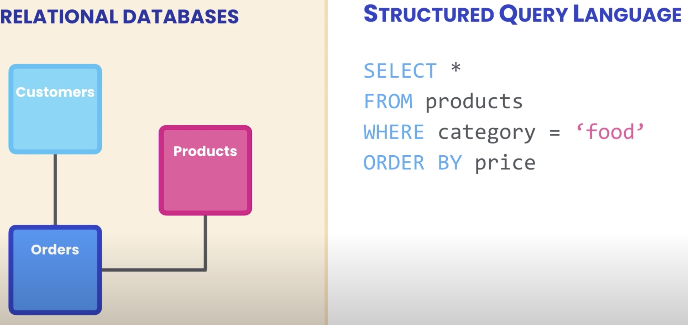
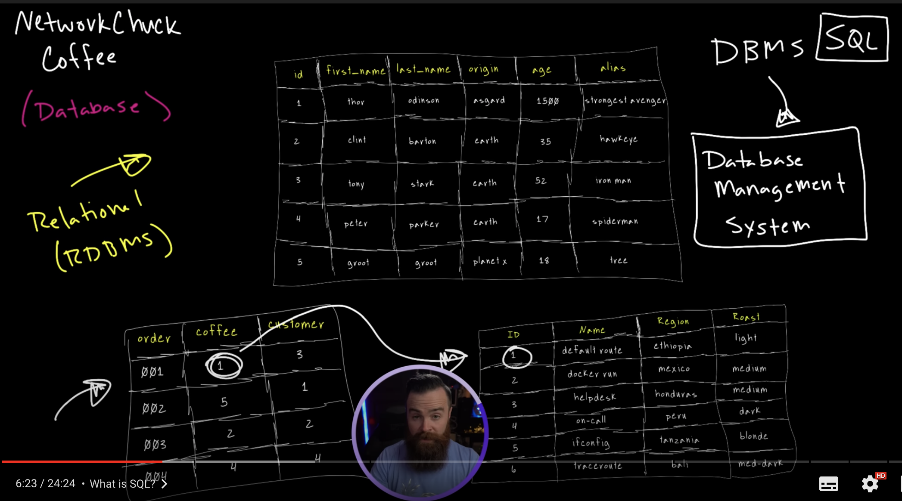

# MySQL

SQL (Structured Query Lenguaje) es un lenguaje implementado para el manejo de base de datos.

Hay 2 tipos de base de datos:

- Relational Database (RDBMS)
- Non relational database (No SQL)

Básicamente en una `relational database` tienes una tabla, cuyo contenido, hace referencia al contenido de otra tabla que a su vez es otra base de datos, etc.

_ejemplo:_




SQL es manejado por distintos programas:
DBMS (Database Management SQL):

- Microsoft SQL Server
- MySQL
- PostgreSQL
- Oracle

El trabajo de esos programas a fin de cuentas es manejar tu base de datos.
Cada uno tiene su manera de hacerlo, pero todos usan SQL.

<br>

---

<br>

## `Cómo extraer data de una tabla`

### _`USE`_ `y` _`SELECT`_ `statements`

Esto lo haces escribiendo un query.

Asumiendo que ya tienes distintas bases de datos, creas una nueva tab de query en tu workbench.

Primero tienes que usar la palabra reservada
'**USE**', a manera de import cual react.

```SQL
USE sql_store
```

Con esa linea es como que estas ya targeteando a esa base de datos.

Luego tienes que usar el select statement.
El SELECT statement va seguido de las columns que quieres extraer (sin son varias, las separas con una coma), seguido de un _`FROM`_, después del cual, va escrito la tabla en donde están encontradas las columnas que le especificaste al _`SELECT`_

```SQL
USE sql_store;

SELECT costomer_id, first_name FROM customers
```

Si quieras extraer todas las columnas, simplemente escribirías con un asterisco, así:

```SQL
USE sql_store;

SELECT * FROM customers
```

Nota como se usa punto y coma despues de cada statement.

Al correr este código, deberías tener ya generada, una tabla con los elementos de la tabla que especificaste :)

<br>

### _`WHERE`_

Hasta ahora has usado las cláusulas `select` y `from`, pero existen muchas más.
Por ejemplo, puedes usar la cláusula `where` para filtrar la data, y especificar que por ejemplo, te devuelva un cliente, cuyo id sea el de 1:

```SQL
USE sql_store;

SELECT * FROM customers WHERE customer_id = 1
```

Ese código o expresión ahora te devolvería un solo cliente en tu tabla.

<br>

### _`ORDER BY`_

Con esto podrías ordenarlos como en orden albatético, numérico, etc, dependiendo de la columna que le especifiques.

```SQL
USE sql_store;

SELECT * FROM customers WHERE customer_id = 1

ORDER BY first_name
```

En este específico caso no tendría ningún efecto, ya que por defecto, esta expresión solo te devuelve un cliente.
Para eso comentaríamos el segundo statement, así:

```SQL
USE sql_store;

-- SELECT * FROM customers WHERE customer_id = 1

ORDER BY first_name
```

Más adelante entraremos más en detalle sobre estas clauses, pero lo que debes saber hasta ahora, es que:

- from, where y order by son opcionales
- cuando son escritas, deben ser escritas en ese orden.

<br>

---

<br>

## `Clauses en detalle`

### _**`Select`**_

Puedes pedir toda la tabla con

```SQL
SELECT *
FROM customers
```

<br>
Puedes especificar que columnas deseas, para no tener que traer una pila de data innecesaria:

```SQL
SELECT first_name, last_name
FROM customers
```

Esto te devuelve dos columnas, en el orden que las especificaste.

<br>

Otro ejemplo, pero ahora con 3 columnas:

```SQL
SELECT first_name, last_name, points
FROM customers
```

<br>

Puedes regresar los puntos y otra columna que tenga una expresión matemática, como por ejemplo, sumarle un valor a los puntos pre-existentes:

```SQL
SELECT first_name, last_name, points, points + 10
FROM customers
```

_`Esta de arriba de devolvería 4 columnas. Siendo la 4ta una suma`_

<br>

Cuando tienes ya una linea muy larga, puedes escribir cada elemento en su propia linea, correctamente tabulado:

```SQL
SELECT
    first_name,
    last_name,
    points,
    points + 10 * 100
FROM customers
```

_`Nótese que en una expresión matemática, primero se resuelven las multiplicaciones, luego las sumas`_

Puedes usar paréntesis para especificar:

```SQL
SELECT
    first_name,
    last_name,
    points,
    (points + 10) * 100
FROM customers
```

<br>

Ahora, por ejemplo, el código de arriba te devolvería 4 columnas.
Cada uno con su respectivo nombre, pero como podrás ver, la 4ta columna se te creará, con ese nombre.
Lo que puedes hacer es usar el alias '`as`', para editar el título de la nueva columna:

```SQL
SELECT
    first_name,
    last_name,
    points,
    (points + 10) * 100 AS discount_factor
FROM customers
```

| first_name | last_name | points | discount_factor |
| ---------- | --------- | ------ | --------------- |
| Juan       | Enderica  | 500    | 51000           |
| Manuel     | Fayad     | 600    | 61000           |

#### _**`DISTINCT`**_ keyword

Digamos que en tu tabla de clientes, tienes una columa con resspectivas ciudades o estados:
| first_name | last_name | points | state |
| ---------- | --------- | ------ | --------------- |
| Juan | Enderica | 500 | Guayas |
| Manuel | Fayad | 600 | Quito |
| Pablo | Jiemnez | 600 | Cuenca |
| Josué | Jiemnez | 700 | Cuenca |

Si tu piedes, con el select, la columan de state, el código te devolverá una tabla, con los estados tal cual, y en caso de haber duplicados, igual te los regresa:
| state |
| ------ |
| Guayas |
| Quito |
| Cuenca |
| Cuenca |

<br>

Con la keyword `distinct`, el código te regresa todos los estados, pero sin duplicados:

```SQL
SELECT DISTINCT state
FROM customers
```

| state  |
| ------ |
| Guayas |
| Quito  |
| Cuenca |

<br>

---

<br>

<!-- ## `Clauses en detalle` -->

### _**`Where`**_

Como está especificado más arriba, la where clause se la usa para filtrar data.

Por ejemplo en este código:

```SQL
SELECT *
FROM customers
WHERE points > 3000
```

Lo que le estas diciendo es 'tráeme todas las columnas de customers, pero incluye solo a las que tengo mas de 3000 puntos'
Eso lo logra, iterando por todas las filas en la tablas de customers, y filtrando las que no cumplan la condición.

### **operadores de comparación**:

- mayor >
- mayor o igual >=
- menor <
- menor o igual <=
- = igual
- != no igual
- <> no igual

Por ejemplo, teniendo la siguiente tabla:
| first_name | last_name | points | state |
| ---------- | --------- | ------ | --------------- |
| Juan | Enderica | 500 | Guayas |
| Manuel | Fayad | 600 | Quito |
| Pablo | Jiemnez | 600 | Cuenca |
| Josué | Jiemnez | 700 | Cuenca |

Para elegir solo los que viven en Cuenca:

```SQL
SELECT *
FROM customers
WHERE state = 'Cuenca'
```

_`nótese las comillas, pueden ser t_ambien doble, y tampoco importan las mayúsculas`_

<br>

### **fechas**:

Teniendo la siguiente tabla:
| first_name | nacimiento | points | state |
| ---------- | --------- | ------ | --------------- |
| Juan | 1991-07-20 | 500 | Guayas |
| Manuel | 1234-06-18 | 600 | Quito |
| Pablo | 1990-07-09 | 500 | Cuenca |
| Josué | 1928-12-12 | 700 | Cuenca |

Con fechas tienes que tener claro que el standar en MySQL es:
`año(4dígitios)-mes(2dïgitos)-día`

ejemplo:

    1991-20-08

Entonces, si tu quisieras pedir a los clientes que sean del 90 en adelante, lo pides asi:

```SQL
SELECT *
FROM customers
WHERE nacimiento >= '1990-01-01'
```

##### _`nótese que las fechas no son strings, pero de igual manera las debes escribir dentro de comillas`_

<br>

---

<br>

### _**`AND, OR y NOT`**_ operators

Asumiendo que en la siguiente tabla, quiereas extraer, al igual que el ejemplo anterior, los clientes que son del 90 en adelante, pero tambien que tengan más de 600 puntos.

La tabla:
| first_name | nacimiento | points | state |
| ---------- | --------- | ------ | --------------- |
| Juan | 1991-07-20 | 500 | Guayas |
| Manuel | 1234-06-18 | 600 | Quito |
| Pablo | 1990-07-09 | 500 | Cuenca |
| Josué | 1928-12-12 | 700 | Cuenca |

El código:

```SQL
SELECT *
FROM customers
WHERE nacimiento >= '1990-01-01' AND points > 600
```

Una vez que ejecutes ese query, te devolverá clientes que cumplan con las dos condiciones.

En contraste a `and`, tenemos el operador `or`, el cual te devolvería clientes con tal de que una de las condiciones se cumplan.

ejemplo:

```SQL
SELECT *
FROM customers
WHERE nacimiento >= '1990-01-01' OR points > 600
```

Puedes mezclar los dos en una linea:

```SQL
SELECT *
FROM customers
WHERE nacimiento >= '1990-01-01' OR points > 600 AND state = 'Guayas'
```

Eso te devolvería cualquier cliente que

- o nació del 90 para arriba
- o tenga más de 600 puntos pero que tambien haya nacido en Guayas

**_`cabe recalcar que el and, precede al or, por lo cual es evaluado antes en la ejecución`_**

Una manera más limpia de escribir el código de arriba, para que se entienda mejor, sería:

```SQL
SELECT *
FROM customers
WHERE nacimiento >= '1990-01-01' OR
    (points > 600 AND state = 'Guayas')
```

El operado `not` se lo usa para negar una condición.
Es decir, asumiendo que tenemos el siguiente código que ya hemos usado más arriba:

```SQL
SELECT *
FROM customers
WHERE nacimiento >= '1990-01-01' OR points > 600
```

Eso te devolvería clientes que cumplan con cualquier de esas condiciones.
Ahora, que pasa si queremos a los clientes que **NO** cumplan con ninguna de esas condiciones:

```SQL
SELECT *
FROM customers
WHERE NOT (nacimiento >= '1990-01-01' OR points > 600)
```

**_`Puedes no usar paréntesis, pero se entiende mejor si los usas`_**

Eso entonces te devuelve clientes que no nacieron en los 90's o después, pero que tampoco tienen más de 600 puntos, ya que ni una de las condiciones se puede cumplir.

Es decir, este código que acabamos de usar:

```SQL
SELECT *
FROM customers
WHERE NOT (nacimiento >= '1990-01-01' OR points > 600)
```

Es exactamente lo mismo a esto:

```SQL
SELECT *
FROM customers
WHERE (nacimiento <= '1990-01-01' AND points <= 600)
```

<br>

---

<br>

### _**`IN`**_ operator
