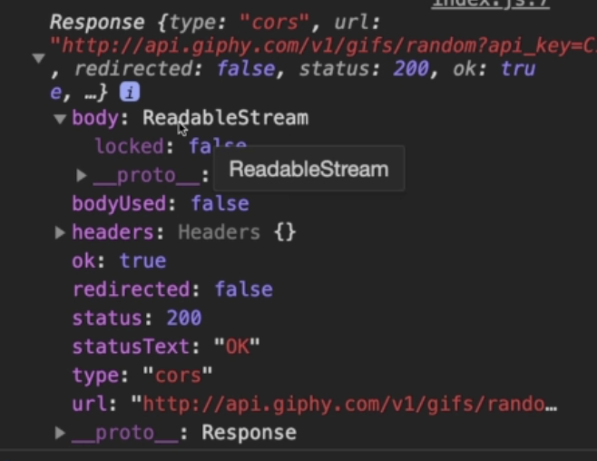
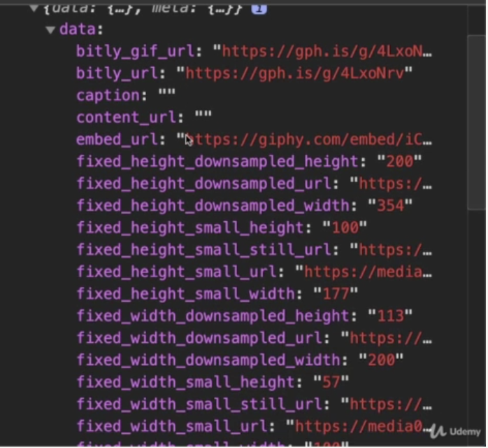
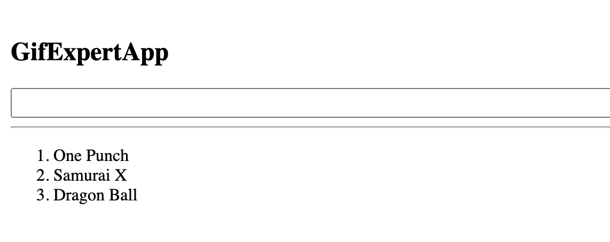

# REACT

##### FROM ZERO TO HERO

---

## `PROMESAS`

Las promesas se crean con:

- palabra reservada 'new'
- palabra reservada Promise (la p con mayúscula)
- con un argumento adentro, que es un callback
- el callback recibe dos argumentos: resolve y reject
- se los llama asi por convención, realmente los puedes llamar como te de la gana
- `resolve` se ejecuta cuando la promesa es exitosa
- `reject` se ejecuta cuando ha habido un error
- setTimeout es una funcion que recibe dos argumentos. Un callback y el tiempo en que ejecutes ese callback.
- En este caso, el `console.log` lo hará después de 2000 milisegundos

```javascript
const promesa = new Promise((resolve, reject) => {
  setTimeout(() => {
    console.log('2 segundos después');
  }, 2000);
});
```

Con ese código, se habrá corrido el resto de código en caso de existir, y dos segundos despues, al final, se cumple tu promesa. Ahora, como hacer para ejecutar código DESPUES de que se cumpla la promesa?
Puedes dejar 'automatizado' eso con disntintos metodos:

- catch()
- finally()
- then()

### `then()`

`then()` lo que pones dentro de then() es lo que se ejecutará una vez que se cumpla la promesa. Then() recibe como parámtro un callback

#### ejemplo:

```javascript
promesa.then(() => {
    console.log('Then de la promesa)
})
```

Ese código de arriba lo escribirías después de declarar la promesa. El código total te quedaría todo así:

```javascript
const promesa = new Promise((resolve, reject) => {
  setTimeout(() => {
    console.log('2 segundos después');
  }, 2000);
});

promesa.then(() => {
    console.log('Then de la promesa)
})
```

Hay un problema con el código de arriba, y es que no se le esta especificando al then absolutamente nada.
Es por eso que al declarar la promesa, ahí tienes que ejecutar el resolve(), al cual le tienes que pasar un parámetro, y por defecto, este se lo pasa al then() que está en el bloque de código de abajo.

Asumamos que en vez de un console log, estas haciendo una solicitud a una API, y eso obviamente lo guardas en una const.
En vez de hacer un console log de ese const en el código de la promesa, puedes ahi escribir un resolve, el cual recibe como parámetro, la const que contiene a esa petición de API.

Esa const es luego pasada por el resolve() al then(), el cual puede ejecutar cualquier linea de código.

#### ejemplo:

```javascript
const promesa = new Promise((resolve, reject) => {
  setTimeout(() => {
    const heroe = estaEsTuPeticionApi(4);
    resolve(heroe);
  }, 2000);
});

promesa.then((heroe) => {
  console.log(heroe);
});
```

Ahora si, con ese código, estas ejecutando asincronismo :)
<br>
Ahora, que pasa, si quieres guardar esa logica, dentro de una función? Es decir, quieres una funcion, a la cual le pasas argumento, y esa te ejecuta la logica, con ese argumento que le estás pasando? Lo tendrías que hacer así:
(asumiendo que ya tienes una funcion que pide api, llamada estaEsTuPeticionApi)

```javascript
const estaEsTuFuncionQuePediraApi = (id) => {
  const promesa = new Promise((resolve, reject) => {
    setTimeout(() => {
      const heroe = estaEsTuPeticionApi(id);
      resolve(heroe);
    }, 2000);
  });
  return promesa;
};
```

Es necesario que pongas ese return, porque si no, esa funcion lo que te devuelve por defecto es void.
Tambien podrías nomas directamente escribir el return arriba:

```javascript
const estaEsTuFuncionQuePediraApi = (id) => {
  return new Promise((resolve, reject) => {
    setTimeout(() => {
      const heroe = estaEsTuPeticionApi(id);
      resolve(heroe);
    }, 2000);
  });
  return promesa;
};
```

Así no estarías creando una constante innecesaria, como en el penúltimo ejemplo. Esta es la manera más usada.
Teniendo esa logica ya atrapada como una funcion, podemos solo escribir en una linea:

```javascript
estaEsTuFuncionParaPedirApi(4).then((heroe) => console.log(heroe));
```

Hasta ahora, solo has trabajado con resolve, asumiendo que tu promesa siempre funciona.
Para implementar el reject, y atrapar ese error con el catch, tienes que implementar un if else.

<br>

### `catch()`

`cacth()` lo que pones dentro, se ejecutara cuando la promesa devuelva un error

```javascript
const estaEsTuFuncionQuePediraApi = (id) => {
  return new Promise((resolve, reject) => {
    setTimeout(() => {
      const heroe = estaEsTuPeticionApi(id);
      if (heroe) {
        resolve(heroe);
      } else {
        reject('Tuvimos un error');
      }
    }, 2000);
  });
  return promesa;
};

estaEsTuFuncionParaPedirApi(4).then((heroe) => console.log(heroe));
.catch(err => console.warning(err))
```

`finally()` se ejecuta despues del then o despues del catch, es decir, ya sea que se haya ejecutado cualquier de esos dos, el finally() es lo que se ejecuta despues de eso.

## mini resumen:

Las promesas básicmente capturan y crean lógica, usando las palabras reservadas `resolve` y `reject`, los cuales reciben parametros, y estos mismos, mandan esos parámetros a otro bloque de lógica el cual posee `.then()` y `.catch()`.
Estos últimos, ejecutan lógica con el argumento que reciben de resolve y reject.
<br>
<br>
<br>

---

## `FETCH API`

La idea en este pdf, es saber básicamente como funciona fetch api y aprender sobre _`promesas en cadena`_

teniendo tu api_key

```javascript
const apiKey = 'XF6VjNxOHCOOHgtNwRLAy5oftKQeWRgT';
```

Y teniendo tu endpoint, que en este caso es:
api.giphy.com/v1/gifs/trending

Si tu vas a ese url por si solo, te devuelve un package json y te dice que no te puede ensenar el contenido ya que no le estas proveendo la api key.
Si vas a ese url de ese endpoint, y agregas '?api_key=', seguido de tu api key, es decir:
https://api.giphy.com/v1/gifs/trending?api_key=XF6VjNxOHCOOHgtNwRLAy5oftKQeWRgT
Ahora si puedes ver el contenido de esa API

Ahora si, la idea es crear una función, que ejecute esa petición, usando la api key y el endpoint.
Para esto usaremos fetch, lo cual, ya está instalado en tu navegador, por eso no hay que instalar nada.

Creas la const, y le metes fetch, el cual recibe el url de tu api.
Como puedes ver, se lo pone en comillas francesas o backticks, ya que usarás strings y tambien tu variable.
Básicamente estás concatenando tu endpoint el cual es un string, con tu const que contiene a tu api key:

```javascript
const peticion = fetch(
  `https://api.giphy.com/v1/gifs/trending?api_key=${apiKey}`
);
```

### `fetch() retorna una promesa la cual se llama response`!!

y como es una promesa, quiere decir que puedes usarle .then(), etc :)

Si tu fueses a hacer un `console.log()` a esa response, la consola te mostraría un objeto.

```javascript
peticion.then((resp) => {
  console.log(resp);
});
```


Lo que te importa, esta dentro de la propiedad body, la cuál aún no se puede acceder.
Para acceder:

```javascript
peticion.then((resp) => {
  resp.json().then((data) => {
    console.log(data);
  });
});
```

Ese código se ve feo, y más adelante veremos como se lo arregla, pero hasta ahora, saber que con esto, ya se muestra la data que nos interesa:


### `Encadenar promesas`

La manera de escribir el mismo último bloque de código, pero más limpio, es usando `promesas en cadena`:

```javascript
peticion
  .then((resp) => resp.json())
  .then((data) => {
    console.log(data);
  })
  .catch(console.warn);
```

este bloque de código, se ve mejor y hace exactamente lo mismo que este que usaste previamente:

```javascript
peticion.then((resp) => {
  resp.json().then((data) => {
    console.log(data);
  });
});
```

Básicamente lo que pasa, es que, el resultado del primer then, es pasado al siguiente then, y así.

##### _no hace falta escribir múltiples `catch()` ya que con uno, atrapas todos los errores_

<br>
Para agregar, el url específico de una imagen, y crear una imagen en el HTML:

```javascript
const apiKey = 'XF6VjNxOHCOOHgtNwRLAy5oftKQeWRgT';

const peticion = fetch(
  `https://api.giphy.com/v1/gifs/trending?api_key=${apiKey}`
);

peticion
  .then((resp) => resp.json())
  .then(({ data }) => {
    const { url } = data.images.original;
    const img = document.createElement('img');
    img.src = url;

    document.body.append(img);
  })
  .catch(console.warn);
```

Date cuenta como se crea una const para la url, luego creas un elemento con el método `createElement()`, y luego le agregas la url al src.
Al final, usando manipulación del dom, en el body, usas el metodo `append()` para agregar esa img, a tu HTML.

---

<br>
<br>

---

## `Async-Await`

Primero un pequeño ejemplo de una promesa:

```javascript
const estaEsTuPromesa = () = {
    const promesa = new Promise((resolve, reject) => {
        resolve('https://cualquiercosa.com')
    })
    return promesa;
}

estaEsTuPromesa().then(console.log)
```

El siguiente paso para hacer ese código más corto:

```javascript
const estaEsTuPromesa = () = {
    return new Promise((resolve, reject) => {
        resolve('https://cualquiercosa.com')
    })
    return promesa;
}

estaEsTuPromesa().then(console.log)
```

El siguiente:

```javascript
const estaEsTuPromesa = () => new Promise((resolve =>
        resolve('https://cualquiercosa.com')
    )

estaEsTuPromesa().then(console.log)
```

Hasta este punto, el código está más corto, pero no necesariamente más sencillo de leer.
Aquí es donde entra el `async-await`

Se puede lograr lo mismo que los códigos de arriba, de esta manera:

```javascript
const getImage = () => {
  return 'https://cualquiercosa.com';
};

getImage();
```

Si, retorna lo mismo que el otro código, pero con una gran diferencia, esto no es aún asíncrono.
Para hacerlo asíncrono:

```javascript
const getImage = async () => {
  return 'https://cualquiercosa.com';
};

getImage().then(console.log);
```

Ahora si, lograste que sea asíncrona. Usaste dos cosas:

- la palabra reservada `async` antes de los argumentos
- `.then()` despues de convocar la función.

_el async puede estar independiente, sin necesitar el await. El await siempre necesitará del async_

El await nos permite trabajar nuestro código como si fuese síncrono.

La idea es hacer la siguiente linea de código (sacada de un ejercicio anterior, pero hacerla con async-await):

_(`sin async-await`)_:

```javascript
const apiKey = 'XF6VjNxOHCOOHgtNwRLAy5oftKQeWRgT';

const peticion = fetch(
  `https://api.giphy.com/v1/gifs/trending?api_key=${apiKey}`
);

peticion
  .then((resp) => resp.json())
  .then(({ data }) => {
    const { url } = data.images.original;
    const img = document.createElement('img');
    img.src = url;

    document.body.append(img);
  })
  .catch(console.warn);
```

_(`con async-await`)_:

```javascript
const getImagen = async() => {


    const apiKey='XF6VjNxOHCOOHgtNwRLAy5oftKQeWRgT';

    const peticion = await fetch(`https://api.giphy.com/v1/gifs/trending?api_key=${apiKey})`

    const {data} = await peticion.json();.
    const {url} = data.images.original;

    const img = document.createElement('img);
    img,src = url;
    document.body.append(img);
}
```

En el async-await, para manejar errores, se usa `try` y `catch`:

```javascript
const getImagen = async() => {
    try {
        const apiKey='XF6VjNxOHCOOHgtNwRLAy5oftKQeWRgT';

        const peticion = await fetch(`https://api.giphy.com/v1/gifs/trending?api_key=${apiKey})`

        const {data} = await peticion.json();

        const {url} = data.images.original;

        const img = document.createElement('img');
        img.src = url;

        document.body.append(img);
    } catch(error) {
        #aquí va tu lógica del error
    }
}
```

---

<br>
<br>

---

## `Operación Condicional Ternario`

Este código:

```javascript
const = 'activo'
let mensaje = '';

if (activo) {
    mensaje = 'Activo';
} else {
    mensaje = 'Inactivo'
}
```

Es lo mismo que:

```javascript
const activo = true;
const mensaje = activo ? 'Activo' : 'Inactivo';
```

En caso de querer hacer algo cuando la condición se cumpla pero no hacer nada si no se cumple:

```javascript
const activo = true;
const mensaje = activo ? 'Activo' : null;
```

O mejor:

```javascript
const activo = true;
const mensaje = activo && 'Activo';
```

eso ejecuta solo si la condición se cumple, si no, retorna false.
Esto es bastante útil y facil en react.

---

<br>

<br>

---

# `React`

#### _`Componentes`_

Una pequeña pieza de código encapsulada y re-utilizable, que puede tener un `estado` o no.
Puede ser parent y/o child de otro componente.

#### _`Estado`_

Como se encuentra o considera al componente, en un punto determinado en el tiempo.

---

### `Creando una app`

- Haces cd a la carpeta donde guardarás todo tu proyecto
- Abre la terminal desde esa carpeta
- ```console
  npx create-react-app el-nombre-de-tu-app
  ```
- Con eso se crea tu app
- Has cd a tu carpeta
- ```console
  npm start
  ```

---

### `Borrando archivos innecesarios`

Hasta aquí ya podrías ver tu app, con el template de react.
Puedes ver cómo funciona todo.
El siguiente paso es eliminar el contenido que no vas a usar, eso es el contenido del div en app.js, y reemplazado con un texto como ‘mi proyecto” solo para confirmar de que se sigue renderizando.

También debes borrar:

- app.test.js
- index.css
- logo.svg
- reportWebVitals.js
- setupTest.js

Ahora tienes que medio editar los imports de los archivos que te restaron ya que dependen de esos archivos que has borrado:

- webVitals en index.js
- index.css en index.js
- logo en app.js
- todo el contenido del index.css

---

_`El routeo de una app en react es asi:`_

- Tus componentes son creados en src
- De ahi, ellos van a tu app.jsx (son importados y metidos dentro de un div con sintax de componente)
- De ahi, esa app, es renderizada en root en index.html, via tu index.js

---

_`Hola mundo:`_

```jsx
import React from 'react';
import ReactDOM from 'react-dom';

const saludo = <h1>Hola soy Gokú</h1>;

const divRoot = document.querySelector('#root');

ReactDom.render(saludo, divRoot);
```

El ejemplo de arriba es un simple hola mundo, para entender un poco más de como funciona react a la hora de renderizar.

- import React sirve para poder escribir en JSX
- ReactDom para traer el método render()
- El método render() recibe dos parámetros:
  - Lo que se va a renderizar
  - En dónde lo vas a renderizar

<br>

---

<br>

### `Crear un Componente`

La idea, como está mencionado más arriba, es crear un componente que retorne un html. Este file exporta ese componente, el cual luego sera importado en tu app, la cual es el elemento padre, que contendrá a todos tus componentes.

- Si o si, debes importar react
- imr + tab es shortcut para escribirlo mas áapido
- rafce shortcut para crear el resto de sintax

```jsx
import React from 'react';

const PrimerComponente = () => {
  return <h1>Hola, soy Gokú</h1>;
};

export default PrimerComponente;
```

<br>

ejemplo declarando una variable:

```jsx
import React from 'react';

const PrimerComponente = () => {
  const saludo = 'Hola soy Gokú';

  return <h1>{saludo}</h1>;
};

export default PrimerComponente;
```

<br>

Un ejemplo más práctico:

### _Absolutamente todo, tiene que ir dentro de un mismo div, en este caso el header, el cual está dentro del return de la función._

```jsx
import React from 'react';
import './header.css';
import CTA from './CTA';
import ME from '../../assets/pic3.jpeg';
import HeaderSocials from './HeaderSocials';

const Header = () => {
  return (
    <header>
      <div className="container header__container">
        <h5>Hi! I'm</h5>
        <h1>Juan Manuel</h1>
        <h5 className="text-light">Fullstack dev</h5>
        <CTA />
        <HeaderSocials />

        <div className="me">
          
        </div>

        <a href="#contact" className="scroll__down">
          Scroll Down
        </a>
      </div>
    </header>
  );
};

export default Header;
```

- Mira como importa hasta otros componentes, y los mete dentro del 'html'
- mira como importa un img y le asigna un nombre {me}, para luego ponerlo como src, con **ESA** sintax.
- mira como esta importado el css

Hecho eso, ese componente, irá importado en el componente de tu app, y será invocado ahí mismo dentro del 'HTML' (en verdad es JSX), con sintax de JSX, dentro de la arrow function de tu app. es decir, tu app es el elemento padre de todos tus otros componentes:

```jsx
<TuComponente />
```

_ejemplo:_

```jsx
import React from 'react';
import Nav from './components/nav/Nav';
import About from './components/about/About';
import Experience from './components/experience/Experience';
import Portfolio from './components/portfolio/Portfolio';
import Contact from './components/contact/Contact';
import Footer from './components/footer/Footer';

const App = () => {
  return (
    <>
      <Nav />
      <About />
      <Experience />
      <Portfolio />
      <Contact />
      <Footer />
    </>
  );
};

export default App;
```

Una vez que tienes tu app conteniendo a todos los componentes, en tu index.js, tienes que renderizar, tu app, a un index.html.
Esto ya lo vimos mas arriba:

```javascript
import ReactDOM from 'react-dom';
import App from './App';
import './index.css';

ReactDOM.render(<App />, document.querySelector('#root'));
```

<br>

---

<br>
<br>

## ` Props`

Hasta ahora, el routeo es:

componentes -> app.jsx -> index.js -> index.html

Tu app jsx es básicamente la que reune todos tus componentes, para luego ser usada, como un todo, en tu index.js general del proyecto, y poder ser renderizada en tu html.

Esto hace que index js, sea padre de app.jsx, el cual a su vez, es padre de tus componentes.

Un componente padre o parent component le puede mandar, en caso de ser necesario, información a su componente hijo/child component.
Esta info es llamada `props`.

La manera en que funciona es, asumiendo que tienes un componente:

- En el componente, escribes el código como si ya tuvieras esa propiedad que le va a pasar juego el index.js.

- En el index js, al momento de llamar al componente, le pasas ese prop.

ejemplo:

```jsx
import React from 'react';

const TuComponente = ({ saludo }) => {
  return (
    <>
      <h1> {saludo} </h1>
    </>
  );
};

export default TuComponente;
```

Escribes el código, implementando ya el prop, que a este punto es como tu 'decoy'.

Al momento de llamar a este componente en tu app.js, lo haces pasándole el prop, de esta manera:

```jsx
import React from 'react';
import ReactDOM from 'react-dom';
import TuComponente from './TuComponente';

import './index.css';

const divRoot = document.querySelector('#root');

ReactDOM.render(<TuComponente saludo="Hola soy Gokú" />, divRoot);
```

Esto te renderizaría en el DOM, un h1 diciendo 'Hola soy Gokú'.

<br>
<br>

`Valores por defecto`

En caso de que al momento de renderizar tu componente, no se le sea pasado una prop, tu puedes dejar listo previamente, un valor por defecto.

De igual manera, tambien puedes obligar a un cliente u otro programador, a que antes de renderizarlo, se le sea pasado un prop, a tu componente, caso contrario que no funcione. De esta manera logras, en caso de ser necesario, que tu componente funcione como quieras que funcione.

Para poner un valor por defecto:

```jsx
import React from 'react';

const TuComponente = ({ saludo = 'Hola, soy Gokú', subtitulo = 'texto' }) => {
  return (
    <>
      <h1> {saludo} </h1>
      <p> {subtitulo} </p>
    </>
  );
};

export default TuComponente;
```

###### _`en caso de que sí se le mande igual una prop, react le da prioridad a la prop que fue pasada, sobre el valor por defecto.`_

Esta es la manera más tradicional de hacerlo, pero hay otra manera usando _defaultProps_, esa la escribiré más abajo más luego.

<br>
<br>

`Obligar a recibir prop`

Una manera de hacer la validación del saludo:

```jsx
import React from 'react';

const TuComponente = ({ saludo }) => {
  if (!saludo) {
    throw new Error('el saludo es necesario');
  }

  return (
    <>
      <h1> {saludo} </h1>
    </>
  );
};

export default TuComponente;
```

Esa manera no es ni muy eficiente, mi muy usada.
Una major manera sería usando _`PropTypes.`_

<br>
<br>

### `PropTypes`

Para empezar, debes importarlo:

```jsx
import PropTypes from 'prop-types';
```

Como el nombre lo dice, sirve para especificar el tipo de props, con el que trabajará tu componente.

De esta manera, abajo al final de tu código, puedes escribir un objeto, el cual tendrá el nombre de tu prop, y su valor, que vendría a ser el tipo que tu desees:

```jsx
import React from 'react';
import PropTypes from 'prop-types';

const TuComponente = ({ saludo }) => {
  return (
    <>
      <h1> {saludo} </h1>
    </>
  );
};

TuComponente.propTypes = {
  saludo: Proptypes.string,
};

export default TuComponente;
```

###### _`nótese el uso de las 'p' mayúsculas y minúsculas en la palabra proptypes a lo largo del código. Parece que lo escribí mal yo pero en realidad está todo bien`_

<br>

###### _`En ese código estas especificando que el prop tiene que ser string, pero aún no estás haciendo que sea obligatorio un prop`_

<br>

###### _`el proptype puede ser string, boolean, array, object o lo que quieras`_

<br>

En el ejemplo de arriba, aún no has logrado que el saludo sea obligatorio.
Para hacerlo, lo haces usando el método `.isRequired`

```jsx
import React from 'react';
import PropTypes from 'prop-types';

const TuComponente = ({ saludo }) => {
  return (
    <>
      <h1> {saludo} </h1>
    </>
  );
};

TuComponente.propTypes = {
  saludo: Proptypes.string.isRequired,
};

export default TuComponente;
```

<br>
<br>

### `DefaultProps`

Al principio de esta parte de props, está especificado como poner valores por defecto a las props.

Pero se puede hacer usando defaultProps, que es muy similar a como lo hace PropTypes:

```jsx
import React from 'react';
import PropTypes from 'prop-types';

const TuComponente = ({ saludo }) => {
  return (
    <>
      <h1> {saludo} </h1>
      <p> {subtitulo} </p>
    </>
  );
};

TuComponente.propTypes = {
  saludo: Proptypes.string.isRequired,
};

TuComponente.defaultProps = {
  subtitulo: 'soy un subtítulo',
  saludo: 'Hola, soy Gokú',
};

export default TuComponente;
```

<br>
<br>

### `CounterApp`

Una app bastante precisa para empezar a entender react, es una que cuente cada vez que le des click a un botón, ya que el contador se actualiza en tiempo real, y este conteo es capturado por el index js, y luego es pasado como prop a su hijo, tu componene, el cual será renderizado en el explorado.
Para esto se usa click eventes, useStates y hooks.

PARA COMENZAR, tu componente se escribiría así:

```jsx
import React from 'react';
import PropTypes from 'prop-types';

const CounterApp = ({ value }) => {
  const handleAdd = (e) => {
    console.log(e);
  };

  return (
    <>
      <h1>CounterApp</h1>
      <h2> {value} </h2>

      <button onClick={handleAdd}>+1</button>
    </>
  );
};

CounterApp.propTypes = {
  value: PropTypes.number,
};

export default CounterApp;
```

Básicamente ese código lo que dice es:

- el _onClick_ en react espera siempre un evento.
- Declaramos la función afuera en este caso, pero tambien podía ser declarada dentro del onClick
- Como la función declarada ya recibe un argumento 'e', no es necesario escribirlo dentro del onClick.
- ese prop, tiene que ser un número
- el motivo de que sea un número es porque mediante clickevents, se irá sumando al contador de clicks.

Tu index.js se escribiría así:

```js
import React from 'react';
import ReactDOM from 'react-dom';
import CounterApp from './CounterApp';

import './index.css';

const divRoot = document.querySelector('#root');

ReactDOM.render(<CounterApp value={10} />, divRoot);
```

<br>
<br>

### `HOOKS y USESTATE`

Agregando hooks y useState:

```jsx
import React, (useState) from 'react';
import PropTypes from 'prop-types';


const CounterApp = ({ value }) => {


  const [counter, setCounter] = useState(0);

  const handleAdd = () => {
    setCounter(counter + 1);
  }

  return (
    <>
      <h1>CounterApp</h1>
      <h2> {counter} </h2>

      <button onClick={ handleAdd }>+1</button>
    </>
  );
};

CounterApp.propTypes = {
  value: PropTypes.number,
};

export default CounterApp;
```

- importa useState primero

tienes que entender que useState retorna un array.
El primer elemento del array es el que se lo usará como state.
El segundo elemento, es una función, la cual se la usa para cambiar al state. aA esta función la idea es convocarla mas abajo, pasándole como argumento un array, objeto o cualquier valor que sea el que reemplaze al anterior.
Este segundo elemento puede recibir una arrow function, cuyo argumento, por defecto, react tomará como que es el estado anterior de tu state.

- como useState retorna array, podrías guardalo en una constante, y luego indexar, pero se vería un poco confuso. Por lo tanto tienes que destructurar, por eso se escribe así como array
- Mediante destructuración, declara una constante
- Esta const, tiene dos elementos: counter (puedes llamarlo como quieras) y tiene setCounter
- Esas son tus dos variables del array que te retorna useState
- useState recibe un argumento, el cual es el valor inicial o por defecto de tu estado, es decir en este caso, de 'counter'
- Al momento de ejecutarse handleAdd, esta ejecuta setCounter, el cual, en este ejemplo, le suma 1 a counter.
- No puedes escribir setCounter directamente en onClick (o sea puedes, pero la sintax es especial)
- Finalmente, mira como ahora el h2 de tu html, tiene esa misma variable, counter. La cual es directamente renderizada, cada vez que le dess click, ya que useState la cambia con su función setCounter :)

<br>
<br>

### `handleSubstract y handleReset`

Ya hicimos arriba, un contador el cual suma cada vez que se de click.
Ahora la idea es hacer uno que quite 1 al contador, y otro botón que resetee todo a cero.

- Lo primero, obviamente, es agregar los botones
- Luego la idea es usar el setCounter para alterar el counter.
- En esta ocasión lo escribiré directamente en el onClick solo para demostrar como sería la sintax.

```jsx
import React, (useState) from 'react';
import PropTypes from 'prop-types';


const CounterApp = ({ value = 0 }) => {


  const [counter, setCounter] = useState(value);

  const handleAdd = () => {
    setCounter(counter + 1);
  }

  return (
    <>
      <h1>CounterApp</h1>
      <h2> {counter} </h2>

      <button onClick={ handleAdd }>+1</button>
      <button onClick={ ()=> setCounter(value)}>Reset</button>
      <button onClick={ ()=> setCounter(counter - 1)}>-1</button>
    </>
  );
};

CounterApp.propTypes = {
  value: PropTypes.number,
};

export default CounterApp;
```

El código de arriba funciona perfectamente. La otra forma de hacerlo sería:

- Creando una función para cada efecto, es decir, para restar y otra para resetear. Para sumar obviamente no porque ya esta creada.
- De esta manera, en el onClick solo necesitaríamos convocar a la función

```jsx
import React, (useState) from 'react';
import PropTypes from 'prop-types';


const CounterApp = ({ value = 0 }) => {


  const [counter, setCounter] = useState(value);

  const handleAdd = () => {
    setCounter(counter + 1);
  }

    const handleSubstract = () => {
    setCounter(counter - 1);
  }

    const handleReset = () => {
    setCounter(value);
  }

  return (
    <>
      <h1>CounterApp</h1>
      <h2> {counter} </h2>

      <button onClick={ handleAdd }>+1</button>
      <button onClick={ handleReset}>Reset</button>
      <button onClick={ handleSubstract}>-1</button>
    </>
  );
};

CounterApp.propTypes = {
  value: PropTypes.number,
};

export default CounterApp;
```

<br>

---

<br>
<br>

## `Pruebas Unitarias y de Integración`

Las pruebas unitarias están enfocadas en pequeñas funcionalidades de tu aplicación.

Las de integración están enfocadas en como reaccionan varias piezas o funcionalidades en conjunto.

**Las pruebas son locales, y se ejecutan en el desarrolo de tu aplicación.
No se las desplega porque se las excluye al momento de hacer el bundle de producción. De esta manera no hacen tu aplicación más lenta para el cliente.**

Como un ejemplo visual:
Digamos que tienes un carro.
Una prueba unitaria seria la llanta. Cual componente aislado, será puesta a prueba para ver que gire bien, que no haya deformaciones, etc.

Una de integración sería que tomes 4 llantas, y las pruebas con el resto de la carrocería para ver si se integran y funcionan correctamente.

Cuando hablamos de pruebas en programación, tienen que tener ciertas características:

- Fáciles de escribir
- Fáciles de leer
- Confiables
- Rápidas
- Principalmente unitarias (porque si tienes todas las piezas de tu aplicación bien testeadas, una prueba de integración bastaría para confirmar la integración entre todas las piezas)

Esos pasos de arriba se aplican y son conocidos como AAA

- Arrenge
- Act
- Assert

`Arrenge`

En este paso se establece el estado inicial.
En este paso:

- Inicializamos variables
- Hacemos importaciones necesarias
- En general, preparamos el ambiente en donde probar

`Act`

En este paso se aplican acciones y estímulos al sujeto de prueba.
En este paso:

- Llamamos métodos
- Simulamos clicks
- Realizar cualquier acción, sobre el paso anterior

`Assert`

En este paso se observa el comportamiento resultante.
Aqui se observa:

- Si los resultados son los esperados, o si algo incremento, o no paso nada, etc.

<br>

---

<br>
<br>

## `Gif APP`

En esta parte crearemos una react app desde cero, la cual consume de la API de giphy.
Usaremos:

- React
- Consumo de API
- Hooks de react
- Implementar un buscador que lea lo que le escribimos
- Testing

Primero, tu app se ve asi:


Para empezar, tenemos nuesstra app la cual es un componente. Dentro de ella, tambien hay otro componente (la input box):

```js
import React, { useState } from 'react';
import { AddCategory } from './components/AddCategory';

const GifExpertApp = () => {
  const [categories, setCategories] = useState([
    'One Punch',
    'Samurai X',
    'Dragon Ball',
  ]);

  return (
    <div>
      <h2>GifExpertApp</h2>
      <AddCategory setCategories={setCategories} />
      <hr></hr>

      <ol>
        {categories.map((category) => {
          return <li key={category}>{category}</li>;
        })}
      </ol>
    </div>
  );
};

export default GifExpertApp;
```

- Esta app hasta ahora lo que hace es que lo que sea que escribas en el input box, se agrega a la lista de series que ya está escrita abajo.
- Esta lista es un array como puedes ver.
- Esta app contiene:
  - un h2
  - un componente al cual se le pasa un prop el cual es el que se agregará a la lista de series
  - una horizontal row
  - una ordered list, la cual esta hecha usando el método map. El map como puedes ver entra al array de tus series y retorna cada elemento, como un _li_

El otro componente:

```js
import React, { useState } from 'react';
import PropTypes from 'prop-types';

export const AddCategory = () => {
  const [inputValue, setInputValue] = useState('');

  const handleInputChange = (e) => {
    setInputValue(e.target.value);
  };

  return (
    <div>
      <input type="text" value={inputValue} onChange={handleInputChange} />
    </div>
  );
};

AddCategory.propTypes = {
  setCategories: PropTypes.func.isRequired,
};
```

- Este componente es básicamente una caja de input.
- Usaremos useStates para cambiar el valor de lo que dice la caja.
- El valor de la caja esta asignado a inputValue
- No se puede cambiar así no mas el valor de la caja si no que debemos usar la función interna llamada 'onChange', dentro del button
- El onChange está hecho para que se dispare cada vez que la caja de texto cambie
- Siempre una buena manera de ver el nombre del evento que dispara alguna función como el onChange, para saber cual es, es pasarle el evento (e) y hacer el console.log del e:

```
onChange={(e) => console.log(e)}
```

- Eso te bota alguuuunos valores que pueden cambiar, entonces la idea es saber cual es el que hay que cambiar.
- Luego descubres que e.target.value se le llama al valor de la caja de texto
- Al detectar un cambio en el button, haremos que se dispare la función handleInputChange, la cuál cambiará ese e.target.value
- en handleInputChange se corre la función setInputValue que es el segundo parámetro de tu useState, la cual recibe el e.target.value
- De esa manera, el setInputValue cambia el valor del inputValue, por lo que sea que estas escribiendo y como ese inputValue esta asignado como el valor de tu button, este cambiará cada vez que escribas algo.

Hata ese punto, hay que manejar que es lo que pasa cuando una persona de enter a lo que sea que escriba en esa caja de texto.

Para eso crearemos la función handleSubmit:

```js
import React, { useState } from 'react';
import PropTypes from 'prop-types';

export const AddCategory = () => {
  const [inputValue, setInputValue] = useState('');

  const handleInputChange = (e) => {
    setInputValue(e.target.value);
  };

  const handleSubmit = (e) => {
    e.preventDefault();
  };

  return (
    <div>
      <form onSubmit={handleSubmit}>
        <input type="text" value={inputValue} onChange={handleInputChange} />
      </form>
    </div>
  );
};

AddCategory.propTypes = {
  setCategories: PropTypes.func.isRequired,
};
```

- Ponemos el input dentro de un form, cuya propiedad onSubmit, disparará la función handlSubmit.
- Para empezar, para prevenir que haya un refresheo de página cada vez que se haga un submit, usamos el metodo e.preventDefault()
- Ahora la idea es, que cuando se de click en submit, eso que escribiste se agregue al componente padre, el cual contiene la lista de series.
- Ese último paso vendría a ser 'comunicación entre componentes'

Hasta ahora, en el componente padre, la manera que tenemos de agregar elementos a la lista es mediante el useState (llamado setCategories), entonces lo que tenemos que hacer, es, desde la caja de texto que es el componente hijo, hacer que se dispare el addCategory cada bez que una persona de click en enter.

Como se hace eso? Pues sencillo, como componente padre que es, al momento de escribirlo en el código, se lo mandas la función setCategories como prop:

```JSX
import React, { useState } from 'react';
import { AddCategory } from './components/AddCategory';

const GifExpertApp = () => {
  const [categories, setCategories] = useState([
    'One Punch',
    'Samurai X',
    'Dragon Ball',
  ]);

  return (
    <div>
      <h2>GifExpertApp</h2>
      <AddCategory setCategories={setCategories} />
      <hr></hr>

      <ol>
        {categories.map((category) => {
          return <li key={category}>{category}</li>;
        })}
      </ol>
    </div>
  );
};

export default GifExpertApp;
```

Ahora tenemos que escribir en el componente hijo (AddCategories) el decoy de esa prop, cosa que el sepa que hacer con ella cuando la reciba:

```js
import React, { useState } from 'react';
import PropTypes from 'prop-types';

export const AddCategory = ({ setCategories }) => {
  const [inputValue, setInputValue] = useState('');

  const handleInputChange = (e) => {
    setInputValue(e.target.value);
  };

  const handleSubmit = (e) => {
    e.preventDefault();
    setCategories((cats) => [...cats, inputValue]);
    setInputValue('');
  };

  return (
    <div>
      <form onSubmit={handleSubmit}>
        <input type="text" value={inputValue} onChange={handleInputChange} />
      </form>
    </div>
  );
};
```

- Como puedes ver, setCategories fue pasado a este componente.
- setCategories es una función
- setCategories ya sabe cuales son los estados anteriores del useState
- Ese estado lo recibe como callback
- En este caso lo hemos llamado cats
- Como debes recordar, setCategories necesita dos parametros en su función:
  - Qué va a cambiaer
  - Con qué lo va a reemplazar
- Por eso es que se le pasa cats
- Entre corchetes se está diciendo 'cambiame cats (que ya sabemos que es el useState anterior, por el inputValue)

Hasta ahí ya esta funcionando como debería tu app, pero hay dos cosas que podemos hacer:

- Que sea obligatorio que le pases una prop al componente hijo
- Hacer que no acepte un inputValue de un espacio vacio o texto en blanco, ya que hasta este punto, si no escribes nad ay das enter, igual lo agrega a la lista

Para solucionar esos dos itemss escritos arriba, el código sería así:

```js
import React, { useState } from 'react';
import PropTypes from 'prop-types';

export const AddCategory = ({ setCategories }) => {
  const [inputValue, setInputValue] = useState('');

  const handleInputChange = (e) => {
    setInputValue(e.target.value);
  };

  const handleSubmit = (e) => {
    e.preventDefault();
    if (inputValue.trim().length > 2) {
      setCategories((cats) => [...cats, inputValue]);
      setInputValue('');
    }
  };

  return (
    <div>
      <form onSubmit={handleSubmit}>
        <input type="text" value={inputValue} onChange={handleInputChange} />
      </form>
    </div>
  );
};

AddCategory.propTypes = {
  setCategories: PropTypes.func.isRequired,
};
```

<br>

<br>

## `Implementando Fetch API a la aplicación`

Hasta ahora ya tenemos una app que es un componente, la cual contienen a otro componente.
Este segundo componente es una caja de texto, la cual recibe texto y al poner enter, este texto ingresado se agrega a una lista.

Ahora la idea es hacer que en vez de ser agregado no más a la lista, tu app haga una petición a una API con ese texto, la cual te deba regresar gifs relacionados con la categoría que buscaste, y que estos gifs sea desplegados en tu app.

Recuerdas que en tu componente principal, lo que hacía para renderizar la lista de series, era un `método map`?
(chequealo en el código abajo) Hasta ahora tus dos componentes:

```js
import React, { useState } from 'react';
import { AddCategory } from './components/AddCategory';

const GifExpertApp = () => {
  const [categories, setCategories] = useState([
    'One Punch',
    'Samurai X',
    'Dragon Ball',
  ]);

  return (
    <div>
      <h2>GifExpertApp</h2>
      <AddCategory setCategories={setCategories} />
      <hr></hr>

      <ol>
        {categories.map((category) => {
          return <li key={category}>{category}</li>;
        })}
      </ol>
    </div>
  );
};

export default GifExpertApp;
```

```js
import React, { useState } from 'react';
import PropTypes from 'prop-types';

export const AddCategory = ({ setCategories }) => {
  const [inputValue, setInputValue] = useState('');

  const handleInputChange = (e) => {
    setInputValue(e.target.value);
  };

  const handleSubmit = (e) => {
    e.preventDefault();
    if (inputValue.trim().length > 2) {
      setCategories((cats) => [...cats, inputValue]);
      setInputValue('');
    }
  };

  return (
    <div>
      <form onSubmit={handleSubmit}>
        <input type="text" value={inputValue} onChange={handleInputChange} />
      </form>
    </div>
  );
};

AddCategory.propTypes = {
  setCategories: PropTypes.func.isRequired,
};
```

Ahora la idea es que en vez de renderizar manualmente esa lista, retorne un nuevo componente, el cual sera la respuesta de tu API.

- Ahora ese metodo map, cada vez que indexe, va a tomar como token el indx en el que esta y lo va a llamar category.
- Cada indexada, va a regresar tu componente gifgrid, al cual se le está pasando la como prop 'category', que es el token de cada indexacion

```js
<ol>
  {categories.map((category) => {
    return <GifGrid key={category} category={category} />;
  })}
</ol>
```

Con todo lo hecho anteriormente, ya sabemos que el componente GifGrid SI está agarrando la categoría.
Ahora lo que tenemos que hacer es que con esa categoría que se la está pasando el método map, el haga una petición Http.

**La idea es mediante fetch API, bajarse esos gifs, guardarlos en una constante, y luego esa constante pasarla al useState.
De esa manera, el estado del componente cambia cada vez que se haga una petición**

```js
import React, { useState, useEffect } from 'react';

export const GifGrid = ({ category }) => {
  const [images, setimages] = useState([]);

  useEffect(() => {
    getGifs();
  }, []);

  const getGifs = async () => {
    const url =
      'https://api.giphy.com/v1/gifs/search?q=rickandmorty&limit=10&api_key=XF6VjNxOHCOOHgtNwRLAy5oftKQeWRgT';
    const resp = await fetch(url);
    const { data } = await resp.json();

    const gifs = data.map((img) => {
      return {
        id: img.id,
        title: img.title,
        url: img.images?.downsized_medium.url,
      };
    });

    setimages(gifs);
  };

  return (
    <div>
      <h3>{category}</h3>
      <ol>
        {images.map((img) => (
          <li key={img.id}>{img.title}</li>
        ))}
      </ol>
    </div>
  );
};
```

---

<br>

## **_`Hasta aquí haré un desglose y resumen de todo lo que está pasando en la app, así mismo pondre como tengo el código hasta ahora, ya que han cambiado un poco desde los últimos snippets que he subido. La idea de esto es venir a esta parte como referencia, pero si se quiere saber exactamente el proceso de pensamiento que llevo a los snipets a ser como son, quizás ahi si ver más arriba.`_**

Resumen:

Para empezar, saber que tenemos 4 componentes.
Hablemos del primero:

<br>

### **App Component Principal**

- Tu componente principal, el cual es tu app básicamente. Este componente es padre de 3 componentes (2 directos y 1 indirecto)
- Uno de esos componentes es encargado de capturar texto y actualizar el useState de tu app
- El otro componente es encargado de, una vez actualizado el useState de tu app, con ese useState, hacer una petición Http.

Como lo hace?

- Este componente hace un map al useState, y con cada iteración, retorna un componente llamado GifGrid, al cual le pasa su useState como prop, y este realiza con eso peticiones a una API.

<br>

### **Componente AddCategory**

- Hijo directo del componente principal
- Este componente es básicamente una caja de texto
- La función de este man, es capturar lo que diga la caja de texto, y con ese valor, actualizar el useState del app component.

<br>

### **Componente GifGrid**

- Hijo directo del componente principal
- La función de este es, una vez actualizado el useState del app componente, hacer una petición a la API.
- Gifgrid tendrá siempre la petición API que hagas, adjuntadas a las que hayas hecho antes. Entonces siempre que busques, solo se agregará las 10 imágenes más a las que ya tenías. Cómo lo hace?:

<br>

- GifGrid recibe como prop, el estado actual de tu app component.
- Dentro de GifGrid, lo que el hace es una petición a la API, usando el prop que recibe de su padre
- Se hace un map a toda esa respuesta, extrayendo solos los datos que queremos, y eso se guarda en una const.
- Esa nueva constante, se transforma en el actual useState de GifGrid
- GifGrid mapeará por cada imagen que tiene tu useState actual, cada iteración devolverá a su componente hijo: GifGridItem
- Ese mapeo regresa el id de cada imagen sumada a todas las iteraciones anteriores

Míralo de esta manera. Tu app encerrará a un arreglo de categorías.
Tus categorías encerraran a un arreglo de imagenes (Esto es GifGrid)
Tus imágenes independientes se llamarán GifGridItem.

<br>

### **Componente GifGridItem**

-

<br>

---

## **`Scripts`**

### **App Component Principal**

```js
import React, { useState } from 'react';
import { AddCategory } from './components/AddCategory';
import { GifGrid } from './components/GifGrid';

const GifExpertApp = () => {
  const [categories, setCategories] = useState(['One Punch']);

  return (
    <div>
      <h2>GifExpertApp</h2>
      <AddCategory setCategories={setCategories} />
      <hr></hr>
      <ol>
        {categories.map((category) => {
          return <GifGrid key={category} category={category} />;
        })}
      </ol>
    </div>
  );
};

export default GifExpertApp;
```

<br>

### **Componente AddCategory**

```js
import React, { useState } from 'react';
import PropTypes from 'prop-types';

export const AddCategory = ({ setCategories }) => {
  const [inputValue, setInputValue] = useState('');

  const handleInputChange = (e) => {
    setInputValue(e.target.value);
  };

  const handleSubmit = (e) => {
    e.preventDefault();
    if (inputValue.trim().length > 2) {
      setCategories((cats) => [inputValue, ...cats]);
      setInputValue('');
    }
  };

  return (
    <div>
      <form onSubmit={handleSubmit}>
        <input type="text" value={inputValue} onChange={handleInputChange} />
      </form>
    </div>
  );
};

AddCategory.propTypes = {
  setCategories: PropTypes.func.isRequired,
};
```

<br>

### **Componente GifGrid**

```js
import React, { useState, useEffect } from 'react';
import { GifGridItem } from './GifGridItem';

export const GifGrid = ({ category }) => {
  const [images, setimages] = useState([]);

  useEffect(() => {
    getGifs();
  }, []);

  const getGifs = async () => {
    const url = `https://api.giphy.com/v1/gifs/search?q=${encodeURI(
      category
    )}&limit=10&api_key=XF6VjNxOHCOOHgtNwRLAy5oftKQeWRgT`;
    const resp = await fetch(url);
    const { data } = await resp.json();

    const gifs = data.map((img) => {
      return {
        id: img.id,
        title: img.title,
        url: img.images?.downsized_medium.url,
      };
    });

    setimages(gifs);
  };

  return (
    <>
      <h3>{category}</h3>
      <div className="card-grid">
        {images.map((img) => (
          <GifGridItem key={img.id} {...img} />
        ))}
      </div>
    </>
  );
};
```

<br>

### **Componente GifGrid**

```jsx
import React from 'react';

export const GifGridItem = ({ title, url }) => {
  return (
    <div className="card">
      
      <p>{title}</p>
    </div>
  );
};
```

---

<br>

---

<br>

---

<br>
<br>

## `Heroes APP`

---

<br>

---

<br>

---

<br>
<br>

## `Journal APP`
